<!--

-->

 

# Generative variational timbre spaces

This repository describes the additional material and experiments around the paper ["Generative timbre spaces with variational audio synthesis"](dafx18generative.pdf) submitted at the 2018 DaFX Conference.

Timbre spaces have been used in music perception to study the perceptual relationships between instruments based on dissimilarity ratings. However, these spaces do not generalize, need to be reconstructed for each novel example and are not continuous, preventing audio synthesis. In parallel, generative models have aimed to provide methods for synthesizing novel timbres. However, these systems do not provide an explicit control structure, nor do they provide an understanding of their inner workings and are usually not related to any perceptually relevant information.
Here, we show that Variational Auto-Encoders (VAE) can alleviate all of these limitations by constructing _variational generative timbre spaces_. To do so, we adapt VAEs to create a generative latent space, while using perceptual ratings from timbre studies to regularize the organization of this space. The resulting space allows to analyze novel instruments, while being able to synthesize audio from any point of this space. We introduce a specific regularization allowing to directly enforce given perceptual constraints or simi- larity ratings onto these spaces. We compare the resulting space to existing timbre spaces and show that they provide almost similar distance relationships. We evaluate several spectral transforms as input and show that the Non-Stationary Gabor Transform (NSGT) provides the highest correlation to timbre spaces and the best quality of synthesis. Furthermore, we show that these spaces can generalize to novel instruments and can generate any path between in- struments to understand their timbre relationships. As these spaces are continuous, we study how the traditional acoustic descriptors behave along the latent dimensions. We show that even though descriptors have an overall non-linear topology, they follow a locally smooth evolution. Based on this, we introduce a method for _descriptor-based synthesis_ and show that we can control the descriptors of an instrument while keeping its timbre structure.

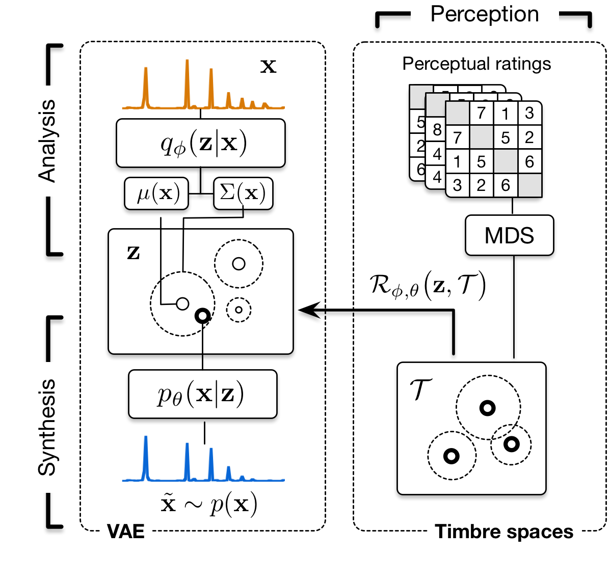

Here, we directly embed the exposed elements
  * [Animations of descriptor space traversal (topology)](#descriptor-space-animations)
  * [Audio examples of synthesized paths in the space](#synthesis-paths-sounds)
  * [Detailed analysis of perceptual inference abilities](#perceptual-inference-abilities)
  * [Additional data and information](#additional-information)
  
Otherwise, you can directly download and parse through the different sub-folders of the [docs/](https://github.com/acids-ircam/variational-timbre/tree/master/docs) folder on GitHub to view all of these informations.

## Descriptor space animations

As detailed in the paper, the space obtained through variational learning are continuous and we can directly sample from these. Therefore, this property allow us to define a dense sampling grid across the space, from which we can generate the spectral distributions. Then, we compute the corresponding descriptors of the distributions at each point of the sampling grid. This allows to plot the continuous evolution of the descriptor topology across the latent spaces. Here, we compare between different models and also provide all topologies across X, Y and Z axes. 

### Model topology comparison

We compare the topology of different descriptors along the X axis between the vanilla (top) and student-regularized (bottom) VAE learned on orchestral instruments.

<b>Centroid</b>

<video id="flatness" class="video-js vjs-default-skin" controls preload="auto" width="600" height="288" data-setup="{}">
<source src="animations/descriptor_space_orig/space3D_centroid_X.mp4" type='video/mp4'>
</video>
<video id="flatness" class="video-js vjs-default-skin" controls preload="auto" width="600" height="288" data-setup="{}">
<source src="animations/descriptor_space_l2/space3D_centroid_X.mp4" type='video/mp4'>
</video>

 
 

<b>Click here if you want to <a href="javascript:look('divSpaceCompare');" title="More comparisons"> see more space comparisons ... </a></b>

 
<b>Flatness</b>

<video id="flatness" class="video-js vjs-default-skin" controls preload="auto" width="600" height="288" data-setup="{}">
<source src="animations/descriptor_space_orig/space3D_flatness_X.mp4" type='video/mp4'>
</video>
<video id="flatness" class="video-js vjs-default-skin" controls preload="auto" width="600" height="288" data-setup="{}">
<source src="animations/descriptor_space_l2/space3D_flatness_X.mp4" type='video/mp4'>
</video>

 
<b>Bandwidth</b>

<video id="flatness" class="video-js vjs-default-skin" controls preload="auto" width="600" height="288" data-setup="{}">
<source src="animations/descriptor_space_orig/space3D_bandwidth_X.mp4" type='video/mp4'>
</video>
<video id="flatness" class="video-js vjs-default-skin" controls preload="auto" width="600" height="288" data-setup="{}">
<source src="animations/descriptor_space_l2/space3D_bandwidth_X.mp4" type='video/mp4'>
</video>

 
<b>Loudness</b>

<video id="flatness" class="video-js vjs-default-skin" controls preload="auto" width="600" height="288" data-setup="{}">
<source src="animations/descriptor_space_orig/space3D_loudness_X.mp4" type='video/mp4'>
</video>
<video id="flatness" class="video-js vjs-default-skin" controls preload="auto" width="600" height="288" data-setup="{}">
<source src="animations/descriptor_space_l2/space3D_loudness_X.mp4" type='video/mp4'>
</video>

 
<b>Rolloff</b>

<video id="flatness" class="video-js vjs-default-skin" controls preload="auto" width="600" height="288" data-setup="{}">
<source src="animations/descriptor_space_orig/space3D_rolloff_X.mp4" type='video/mp4'>
</video>
<video id="flatness" class="video-js vjs-default-skin" controls preload="auto" width="600" height="288" data-setup="{}">
<source src="animations/descriptor_space_l2/space3D_rolloff_X.mp4" type='video/mp4'>
</video>

 

### Complete model topology

Here we provide the complete topology of a student-regularized latent space, by evaluating the _centroid_, _flatness_, _bandwidth_, _loudness_ and _rolloff_ across the X (top), Y (middle) and Z (bottom) axes of the PCA-transformed latent space

 
<b>Centroid</b>

<video id="flatness" class="video-js vjs-default-skin" controls preload="auto" width="600" height="288" data-setup="{}">
<source src="animations/descriptor_space_l2/space3D_centroid_X.mp4" type='video/mp4'>
</video>
<video id="flatness" class="video-js vjs-default-skin" controls preload="auto" width="600" height="288" data-setup="{}">
<source src="animations/descriptor_space_l2/space3D_centroid_Y.mp4" type='video/mp4'>
</video>
<video id="flatness" class="video-js vjs-default-skin" controls preload="auto" width="600" height="288" data-setup="{}">
<source src="animations/descriptor_space_l2/space3D_centroid_Z.mp4" type='video/mp4'>
</video>

 
 

<b>Click here if you want to <a href="javascript:look('divSpaceTopo');" title="More comparisons"> see more full descriptor space topologies ... </a></b>

 
<b>Flatness</b>

<video id="flatness" class="video-js vjs-default-skin" controls preload="auto" width="600" height="288" data-setup="{}">
<source src="animations/descriptor_space_l2/space3D_flatness_X.mp4" type='video/mp4'>
</video>
<video id="flatness" class="video-js vjs-default-skin" controls preload="auto" width="600" height="288" data-setup="{}">
<source src="animations/descriptor_space_l2/space3D_flatness_Y.mp4" type='video/mp4'>
</video>
<video id="flatness" class="video-js vjs-default-skin" controls preload="auto" width="600" height="288" data-setup="{}">
<source src="animations/descriptor_space_l2/space3D_flatness_Z.mp4" type='video/mp4'>
</video>

 
<b>Bandwidth</b>

<video id="flatness" class="video-js vjs-default-skin" controls preload="auto" width="600" height="288" data-setup="{}">
<source src="animations/descriptor_space_l2/space3D_bandwidth_X.mp4" type='video/mp4'>
</video>
<video id="flatness" class="video-js vjs-default-skin" controls preload="auto" width="600" height="288" data-setup="{}">
<source src="animations/descriptor_space_l2/space3D_bandwidth_Y.mp4" type='video/mp4'>
</video>
<video id="flatness" class="video-js vjs-default-skin" controls preload="auto" width="600" height="288" data-setup="{}">
<source src="animations/descriptor_space_l2/space3D_bandwidth_Z.mp4" type='video/mp4'>
</video>

 
<b>Loudness</b>

<video id="flatness" class="video-js vjs-default-skin" controls preload="auto" width="600" height="288" data-setup="{}">
<source src="animations/descriptor_space_l2/space3D_loudness_X.mp4" type='video/mp4'>
</video>
<video id="flatness" class="video-js vjs-default-skin" controls preload="auto" width="600" height="288" data-setup="{}">
<source src="animations/descriptor_space_l2/space3D_loudness_Y.mp4" type='video/mp4'>
</video>
<video id="flatness" class="video-js vjs-default-skin" controls preload="auto" width="600" height="288" data-setup="{}">
<source src="animations/descriptor_space_l2/space3D_loudness_Z.mp4" type='video/mp4'>
</video>

 
<b>Rolloff</b>

<video id="flatness" class="video-js vjs-default-skin" controls preload="auto" width="600" height="288" data-setup="{}">
<source src="animations/descriptor_space_l2/space3D_rolloff_X.mp4" type='video/mp4'>
</video>
<video id="flatness" class="video-js vjs-default-skin" controls preload="auto" width="600" height="288" data-setup="{}">
<source src="animations/descriptor_space_l2/space3D_rolloff_Y.mp4" type='video/mp4'>
</video>
<video id="flatness" class="video-js vjs-default-skin" controls preload="auto" width="600" height="288" data-setup="{}">
<source src="animations/descriptor_space_l2/space3D_rolloff_Z.mp4" type='video/mp4'>
</video>

 

## Synthesis paths sounds

As detailed in the paper, we can synthesize a distribution from any point in the latent space. However, to evaluate the effect of our perceptual regularization, we investigate what happens by synthesizing paths between selected instruments. To synthesize the audio between two instruments, we use the $$\mathbf{z}^{0}_{i}$$ position of a given instrument in the latent space and select randomly another instrument to act as an ending position $$\mathbf{z}^{1}_{j}$$. Then we perform an interpolation between these positions in the latent space, and at each interpolated point $$\mathbf{z}^{t}$$, we use the decoder of the VAE to generate the corresponding distribution. We can either use a _linear_, _spherical_ or _expressive_ interpolation

**Linear**
$$\mathbf{z}^{t} = (1 - t) * \mathbf{z}^{0}_{i} + t * \mathbf{z}^{0}_{j}$$

**Spherical**
$$\mathbf{z}^{t} = \frac{sin((1 - t) * \omega)}{sin(\omega * \mathbf{z}^{0}_{i})} + \frac{sin(t * \omega)}{sin(\omega * \mathbf{z}^{0}_{j}})$$

**Expressive**
$$\mathbf{z}^{t} = \frac{sin((1 - t) * \omega)}{sin(\omega * (\mathbf{z}^{0}_{i} + \delta(\mathbf{z}^{t}_{i}))} + \frac{sin(t * \omega)}{sin(\omega * (\mathbf{z}^{0}_{j} + \delta(\mathbf{z}^{t}_{i}))}$$

To better understand how these different interpolation work, here are two video animations that shows the different paths (spherical or expressive) between the Violin and the Clarinet in latent space, and the corresponding distributions that are being generated.

**Spherical**

<video id="flatness" class="video-js vjs-default-skin" controls preload="auto" width="600" height="288" data-setup="{}">
<source src="animations/paths/note_spherical_Violin_Clarinet-Bb.mp4" type='video/mp4'>
</video>

**Expressive**

<video id="flatness" class="video-js vjs-default-skin" controls preload="auto" width="600" height="288" data-setup="{}">
<source src="animations/paths/note_expressive_Violin_Clarinet-Bb.mp4" type='video/mp4'>
</video>

#### Spherical or expressive interpolations

We start by comparing spherical or expressive interpolations between instruments in the latent spaces. While listening to these examples, keep in mind that **all these models have been trained with a single spectral frames per instrumental note !** 

<table>
  <tr>
    
    <td style="text-align: center; vertical-align: middle;"><b>Origin</b></td>
    <td style="text-align: center; vertical-align: middle;"><b>End</b></td>
    <td style="text-align: center; vertical-align: middle;"><b>Spherical</b></td>
    <td style="text-align: center; vertical-align: middle;"><b>Expressive</b></td>
    
  </tr>
  <tr>
    <td style="text-align: center; vertical-align: middle;">Bassoon</td>
    <td style="text-align: center; vertical-align: middle;">Clarinet Bb</td>
    <td style="text-align: center; vertical-align: middle;">
      <audio controls>
      <source src="audio/l2/note_spherical_Bassoon_Clarinet-Bb.mp3">
      </audio>
    </td>
    <td style="text-align: center; vertical-align: middle;">
      <audio controls>
      <source src="audio/l2/note_expressive_Bassoon_Clarinet-Bb.mp3">
      </audio>
    </td>
  </tr>
  <tr>
    <td style="text-align: center; vertical-align: middle;">Clarinet Bb</td>
    <td style="text-align: center; vertical-align: middle;">Alto Sax</td>
    <td style="text-align: center; vertical-align: middle;">
      <audio controls>
      <source src="audio/l2/note_spherical_Clarinet-Bb_Alto-Sax.mp3">
      </audio>
    </td>
    <td style="text-align: center; vertical-align: middle;">
      <audio controls>
      <source src="audio/l2/note_expressive_Clarinet-Bb_Alto-Sax.mp3">
      </audio>
    </td>
  </tr>
  <tr>
    <td style="text-align: center; vertical-align: middle;">French Horn</td>
    <td style="text-align: center; vertical-align: middle;">Trombone</td>
    <td style="text-align: center; vertical-align: middle;">
      <audio controls>
      <source src="audio/l2/note_spherical_French-Horn_Tenor-Trombone.mp3">
      </audio>
    </td>
    <td style="text-align: center; vertical-align: middle;">
      <audio controls>
      <source src="audio/l2/note_expressive_French-Horn_Tenor-Trombone.mp3">
      </audio>
    </td>
  </tr>
</table>

Next, we provide examples, where the pitch between different instruments is allowed to change, which generates even more complex audio distributions, while remaining perceptually smooth in their evolution.

<audio controls preload="auto" data-setup="{}" width="100%"> 
<source src="audio/original/loudest_expressive_Bassoon_Violoncello.mp3" type='audio/mp3'>
</audio>
Bassoon - Violoncello 
<audio controls preload="auto" data-setup="{}" width="100%"> 
<source src="audio/original/loudest_expressive_English-Horn_Violin.mp3" type='audio/mp3'>
</audio>
English Horn - Violin 
<audio controls preload="auto" data-setup="{}" width="100%"> 
<source src="audio/original/note_expressive_Violin_Alto-Sax.mp3" type='audio/mp3'>
</audio>
Violin - Alto Sax 
<audio controls preload="auto" data-setup="{}" width="100%"> 
<source src="audio/original/loudest_expressive_Oboe_Clarinet-Bb.mp3" type='audio/mp3'>
</audio>
Oboe - Clarinet Bb 
<audio controls preload="auto" data-setup="{}" width="100%"> 
<source src="audio/original/note_expressive_Alto-Sax_Bassoon.mp3" type='audio/mp3'>
</audio>
Alto Sax - Bassoon 

 

<a href="javascript:look('div1');" title="More examples">More examples</a>

<audio controls preload="auto" data-setup="{}" width="100%"> 
<source src="audio/original/note_expressive_Alto-Sax_Clarinet-Bb.mp3" type='audio/mp3'>
</audio>
<audio controls preload="auto" data-setup="{}" width="100%"> 
<source src="audio/original/note_expressive_Alto-Sax_Piano.mp3" type='audio/mp3'>
</audio>
<audio controls preload="auto" data-setup="{}" width="100%"> 
<source src="audio/original/note_expressive_Piano_English-Horn.mp3" type='audio/mp3'>
</audio>
<audio controls preload="auto" data-setup="{}" width="100%"> 
<source src="audio/original/note_expressive_Violin_English-Horn.mp3" type='audio/mp3'>
</audio>
<audio controls preload="auto" data-setup="{}" width="100%"> 
<source src="audio/original/note_expressive_Piano_Alto-Sax.mp3" type='audio/mp3'>
</audio>

 

#### On the flatness of the manifold

We made an interesting discovery while working on the synthesis of paths between different instruments. In fact, it appears that performing a linear or spherical interpolation results in the _exact same spectral distribution_. This seems to underline the overall flatness of the audio manifold in latent space.

#### Expressive and experimental interpolation

By performing some modifications (such as increasing or decreasing translation) on a given path between different instruments, we can obtain interesting and creative types of sounds, as exemplified by the following audio examples

<audio controls preload="auto" data-setup="{}" width="100%"> 
<source src="audio/original/loudest_expressive_French-Horn_Tenor-Trombone.mp3" type='audio/mp3'>
</audio>
<audio controls preload="auto" data-setup="{}" width="100%"> 
<source src="audio/original/loudest_expressive_Piano_Bassoon.mp3" type='audio/mp3'>
</audio>
<audio controls preload="auto" data-setup="{}" width="100%"> 
<source src="audio/l2/loudest_expressive_Alto-Sax_Bassoon.mp3" type='audio/mp3'>
</audio>
<audio controls preload="auto" data-setup="{}" width="100%"> 
<source src="audio/l2/loudest_expressive_Clarinet-Bb_Bassoon.mp3" type='audio/mp3'>
</audio>
<audio controls preload="auto" data-setup="{}" width="100%"> 
<source src="audio/l2/loudest_expressive_French-Horn_Violin.mp3" type='audio/mp3'>
</audio>
<audio controls preload="auto" data-setup="{}" width="100%"> 
<source src="audio/l2/loudest_expressive_Tenor-Trombone_Alto-Sax.mp3" type='audio/mp3'>
</audio>

 

## Perceptual inference abilities

As detailed in the paper, we can perform a projection inside this space of novel instruments, that were not even part of the original studies (nor the overall VAE training). Here, we show that the projection appears to be coherent with the potential perception of these instruments. We display the original latent space (top, left), and show how new instruments are projected in this space compared to the distribution of original instruments centroid (top, right). We then show the comparison of either only centroid (bottom, left) or all points (bottom, right)

### Comparing regularized and vanilla

#### Vanilla VAE

As we can see, the novel instruments are spread all across the latent space.

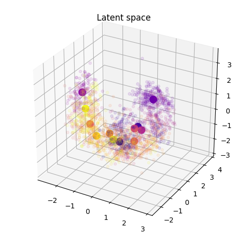  
       
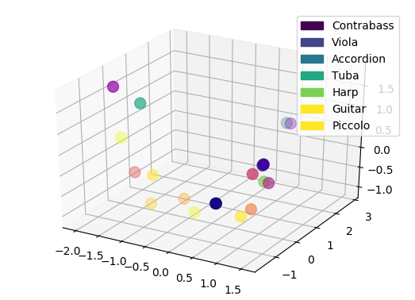 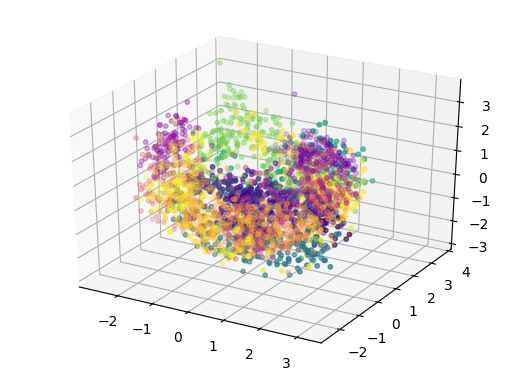 

#### Regularized VAE

Oppositely to the Vanilla version, thanks to the regularization the novel instruments are well grouped inside the latent space and seem to be close to logical instruments in terms of perception.

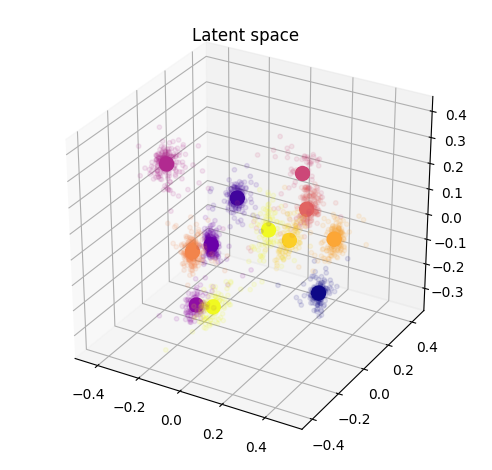 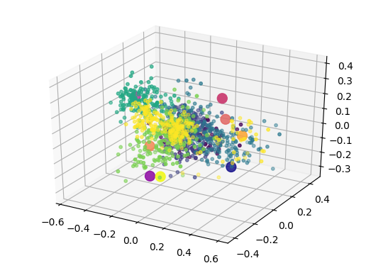 
       
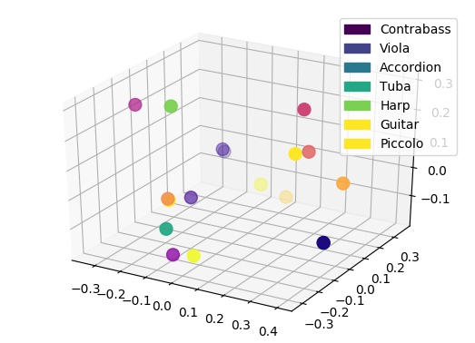 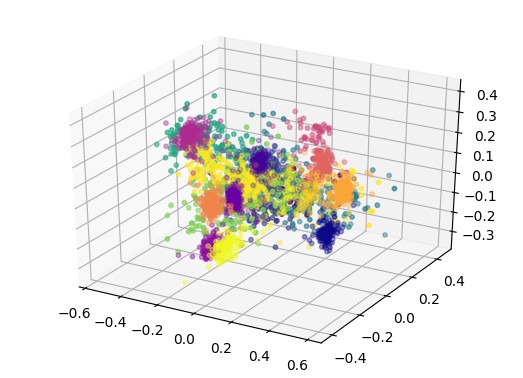 

## Additional information

### Existing timbre spaces verification

Here we provide information on the timbre spaces that were computed based on the normalized versions of past studies. 

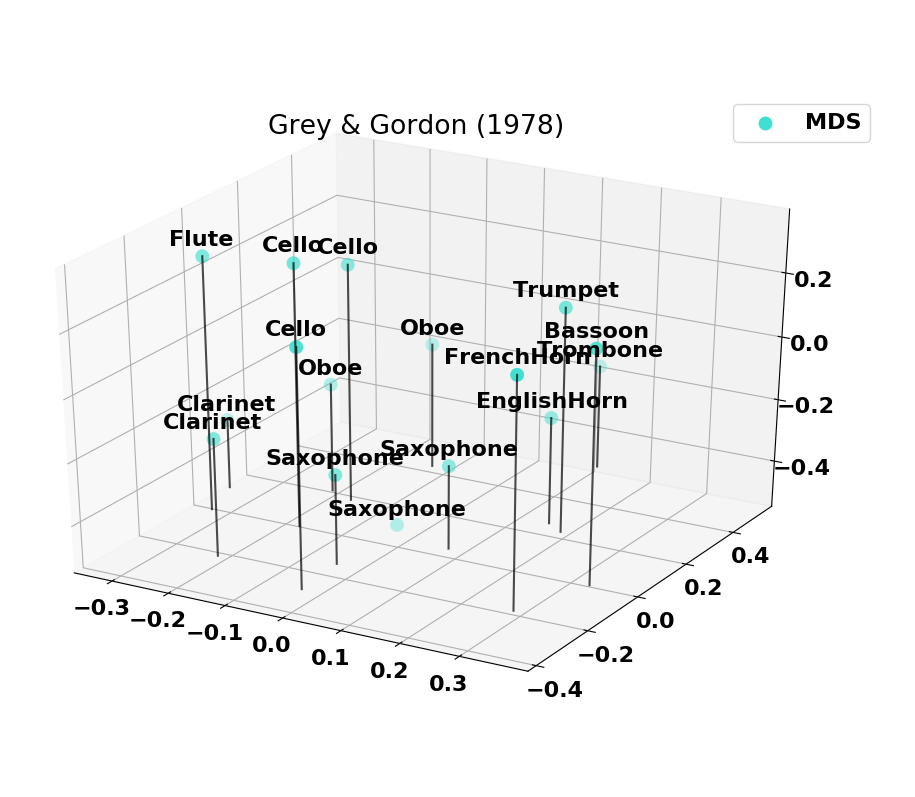 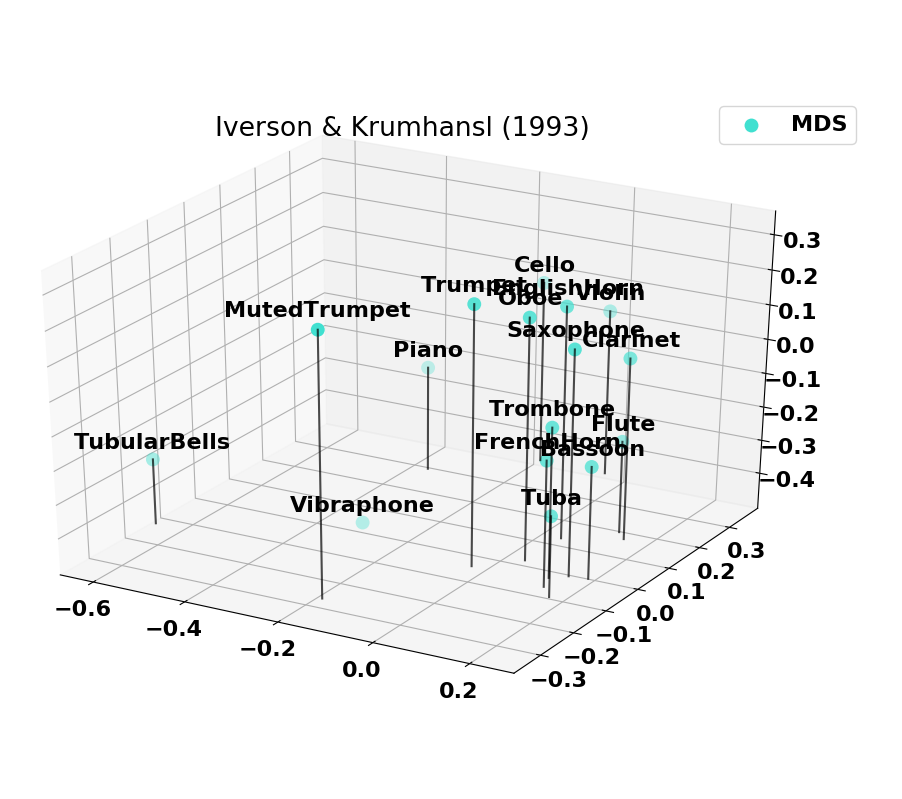 
       
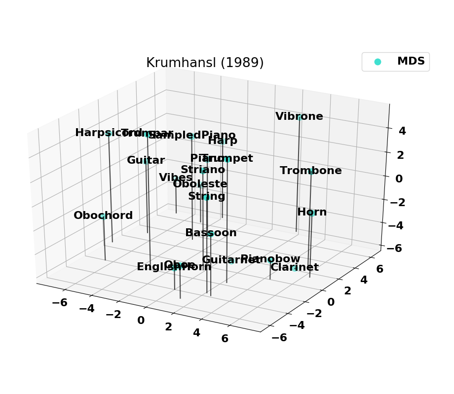 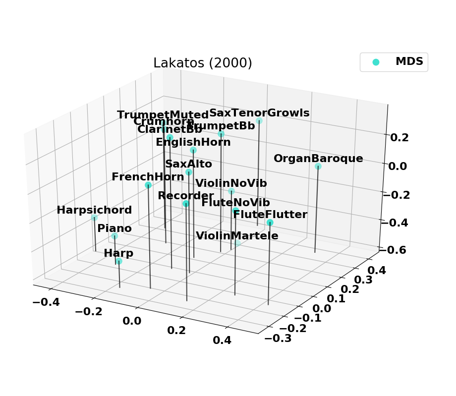 
 
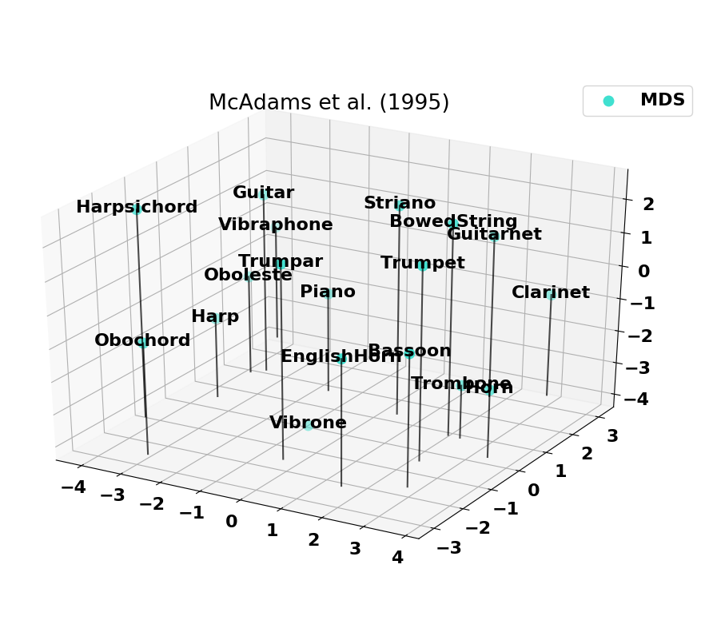

### Co-occurences of instruments

The combined set of instruments from past studies is plotted as a set of co-occurences. On the left is the set of all instruments combined and on the right is the 14 instruments with the highest number of co-occurences. Note that the _Harp_ and _Harpsichord_ have some co-occurences missing (notably with the _Oboe_), which explains why we removed them from the final set.

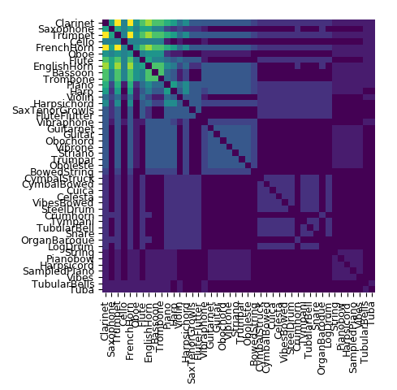 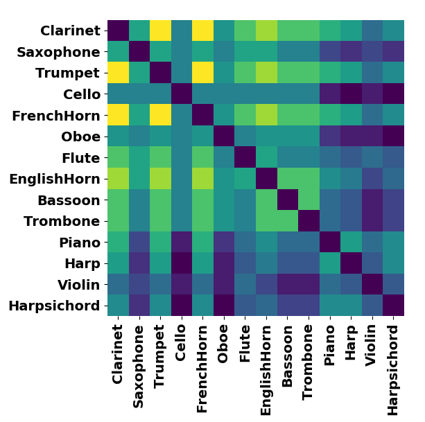 

## Code

**The full code will only be released upon acceptance of the paper at the DaFX 2018 conference** and will be available on the corresponding [GitHub repository](https://github.com/acids-ircam/variational-timbre)
